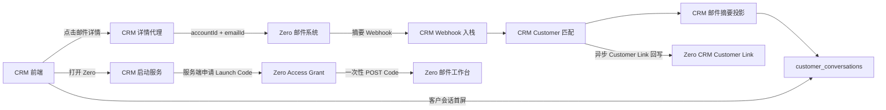

# CRM 与 Zero 邮件集成设计

日期：2026-07-29

## 1. 背景

CRM 当前承担邮件授权、收取、发送、正文与附件存储，以及客户会话时间线展示。目标状态是：

- Zero 成为唯一的邮件收取、发送、正文、附件、线程和投递状态系统。
- CRM 不再连接邮件供应商，也不再保存正文和附件。
- CRM 继续保存客户会话首屏所需的邮件摘要投影。
- CRM 用户可以从 CRM 无感进入 Zero，在独立窗口查看其被授权的多个邮箱账户。
- Zero 可以识别邮件线程所属的 CRM Customer，并按 Customer 分类。

## 2. 目标

1. 使用 Zero Webhook 将邮件摘要可靠同步到 CRM。
2. 复用 CRM 现有 Nango `connect_id` 识别邮箱授权关系。
3. CRM 将匹配到的 Customer 异步回写 Zero。
4. CRM 客户会话首屏继续由 `/customer/im/messages` 提供。
5. 邮件正文、完整参与人和附件由 Zero 按需提供。
6. CRM 用户进入 Zero 时不再次登录。
7. `allowedNangoConnectIds` 决定 Zero 中可展示和切换的邮箱账户。
8. CRM 模式仅暴露邮件工作台，隐藏且禁止设置和连接管理能力。

## 3. 非目标

- 不允许 CRM 直接访问 Zero 数据库。
- 不在 CRM 保存邮件正文、HTML、附件元数据或附件下载地址。
- 不使用 Gmail、Outlook 标签或邮件 keyword 作为 CRM Customer 的权威关联。
- 不把长期 Bearer Token 放入 URL、Local Storage 或前端 JavaScript。
- 不通过 iframe 或微前端嵌入 Zero。
- 不在 CRM 保留邮件发送、回复、转发或重试实现。

## 4. 总体架构



架构采用以下组合：

- 正常同步：Zero Outbox 推送 Webhook。
- 可靠补偿：Webhook 重试和按游标对账。
- 客户归类：CRM 匹配后异步回写 Zero。
- 前端接入：顶层独立窗口、一次性 Launch Code、长期 Zero Session。
- 多账户：Zero 根据 Session 中的允许连接集合展示账户选择器。

## 5. 身份与邮箱连接

### 5.1 CRM 用户到 Zero 用户

Zero 使用稳定外部身份映射：

```text
crm_tenant_id + crm_user_id -> zero_user_id
```

不得只使用邮箱地址映射用户。邮箱可能变更、重复或属于共享邮箱。

SSO 创建或更新用户时必须显式赋予 `crm_user` 角色，不能使用 Zero 的默认管理员角色。

### 5.2 Nango 连接到 Zero 邮箱

CRM 继续使用现有 Nango `connect_id` 作为迁移期和授权来源标识。Zero 已有 Nango authorization binding，可以形成：

```text
nango_connect_id
    -> Zero connection.id
    -> Zero mail_account.id
```

如果一个 Nango 环境中 `connect_id` 不能保证跨 provider 唯一，解析时必须同时使用 provider config key；CRM 对外仍可传允许的 `connect_id` 列表，Zero 根据预置绑定记录完成内部解析。

邮件详情和 Zero 内部权限始终使用：

```text
zero_mail_account_id + zero_email_id
```

不能只用 Nango `connect_id` 定位邮件详情。

## 6. 现有 Nango 连接平滑迁移

在开放 Zero 入口前执行后台预置：

1. CRM 枚举现有 Nango 邮箱连接。
2. CRM 使用服务凭证调用 Zero 的幂等邮箱预置接口。
3. Zero 从同一个 Nango 环境读取现有授权。
4. Zero 创建内部 connection、authorization binding 和 mail account。
5. Zero 开始邮件同步。
6. CRM 记录连接状态：
   - `PROVISIONING`
   - `READY`
   - `REAUTH_REQUIRED`
   - `DISCONNECTED`

已有 Nango Token 有效时，用户不需要再次 OAuth。只有 Nango 授权本身失效时，CRM 才引导用户重新授权。

预置接口按 Nango connection reference 幂等。重复提交不能创建第二个 Zero 邮箱账户。

## 7. Zero 到 CRM 的邮件摘要同步

### 7.1 CRM Webhook

```http
POST /internal/webhooks/zero/mail-events
```

Zero 通过 Outbox 至少投递一次。Webhook 不携带正文、HTML、附件内容或附件下载地址。

```json
{
  "eventId": "evt_001",
  "eventType": "MAIL_SUMMARY_UPSERTED",
  "stateVersion": "128",
  "connectId": "nango_connect_001",
  "zeroMailAccountId": "account_001",
  "zeroEmailId": "email_001",
  "zeroThreadId": "thread_001",
  "direction": "INBOUND",
  "from": [
    {
      "name": "Alice",
      "email": "alice@example.com"
    }
  ],
  "to": [
    {
      "name": "Sales",
      "email": "sales@example.com"
    }
  ],
  "cc": [],
  "subject": "Product inquiry",
  "summary": "客户咨询产品价格和交付时间",
  "status": "RECEIVED",
  "occurredAt": "2026-07-29T08:20:00Z"
}
```

`summary` 是 Zero 提供的首屏展示摘要。初始实现可以使用 Zero 邮件 preview 生成；CRM 只将其作为不透明展示字段保存。

事件类型：

- `MAIL_SUMMARY_UPSERTED`
- `MAIL_SUMMARY_DELETED`

收取、发送、失败和摘要更新均使用 upsert。删除事件用于隐藏或删除 CRM 投影。

### 7.2 CRM 入栈处理

CRM 在本地事务中：

1. 校验 Zero 签名、时间戳和重放窗口。
2. 按 `eventId` 幂等登记入栈事件。
3. 使用 `connectId` 解析 CRM 租户和业务员。
4. 根据参与人邮箱匹配 Customer。
5. Upsert 邮件摘要。
6. 创建或更新时间线记录。
7. 提交事务后返回 `2xx`。

旧 `stateVersion` 事件不能覆盖新版本。

无法唯一匹配 Customer 时，CRM 保存未关联入栈记录并返回 `2xx`，避免 Zero 无限重试。人工绑定后执行正常的摘要落库和 Customer Link 回写。

Customer 匹配采用租户内的标准化邮箱精确匹配：

- 收件邮件匹配 `from`。
- 发件邮件匹配 `to` 和 `cc`。
- 标准化只执行去除首尾空格、域名大小写归一和邮箱大小写归一。
- 不自动删除 `+tag`，避免错误合并不同业务邮箱。
- 命中多个 Customer 时进入待关联状态，不自动选择。

## 8. CRM 邮件摘要投影

CRM 可以继续使用 `customer_emails`，但其职责变为 Zero 摘要投影。

保留或新增：

```text
id
tenant_id
customer_id
zero_mail_account_id
zero_email_id
zero_thread_id
direction
role
sender
subject
summary
status
occurred_at
source_version
created_at
updated_at
```

唯一约束：

```text
(tenant_id, zero_mail_account_id, zero_email_id)
```

摘要状态统一为：

```text
SYNCING
RECEIVED
SENT
FAILED
DELETED
```

Zero 的 inbound lifecycle 和 email submission 状态在 Webhook 生产端映射为上述展示状态，CRM 不再次推断供应商状态。

`customer_conversations.source_private_id` 继续引用 `customer_emails.id`。CRM 前端现有时间线分页、CRM conversation ID 和 `/customer/im/messages` 契约可以继续使用。

以下数据不再落库：

- 正文文本和 HTML
- 完整收件人、CC、BCC 和 Reply-To
- 附件元数据和下载地址
- 原始邮件头和原始载荷

删除：

- `customer_email_contents`
- `customer_email_attachments`

## 9. CRM Customer 回写 Zero

### 9.1 回写时机

单向 Zero Webhook 只能让 CRM 识别邮件。CRM 完成 Customer 匹配和本地事务后，通过 CRM Outbox 异步回写 Zero。

Webhook 响应不等待回写成功。回写失败不会回滚 CRM 邮件摘要，CRM Worker 持续重试。

### 9.2 Zero Customer Link 接口

```http
PUT /internal/crm/mail-accounts/{accountId}/threads/{threadId}/customer-link
```

```json
{
  "sourceEventId": "evt_001",
  "crmTenantId": "tenant_100",
  "crmCustomerId": "customer_200",
  "customerDisplayName": "Alice",
  "matchSource": "EMAIL_EXACT",
  "associationVersion": 1
}
```

解绑：

```http
DELETE /internal/crm/mail-accounts/{accountId}/threads/{threadId}/customer-link
```

客户合并、改绑和人工绑定均复用同一条链路。

### 9.3 Zero 关联模型

关联粒度为 `mail_account_id + thread_id`。同一线程的新邮件自动继承 Customer。

```text
crm_customer_mail_link
----------------------
id
mail_account_id
thread_id
crm_tenant_id
crm_customer_id
customer_display_name
match_source
status
source_event_id
association_version
created_at
updated_at
```

约束：

```text
UNIQUE (mail_account_id, thread_id)
INDEX  (crm_tenant_id, crm_customer_id)
```

Zero 在列表和搜索投影中关联该表，用于：

- 展示 CRM Customer 标签。
- 按 Customer 过滤线程。
- 跳转 CRM Customer 页面。
- 在后续 Webhook 中直接携带已关联的 `crmCustomerId`。

不得将 CRM Customer ID 写入供应商标签或邮件 keyword。

## 10. CRM 邮件详情

CRM 前端继续调用：

```http
GET /customer/im/email/detail?conversationId=...
```

CRM 后端：

1. 使用当前租户读取 conversation 和邮件摘要。
2. 校验 Customer 访问权限。
3. 取得 `zero_mail_account_id + zero_email_id`。
4. 使用 CRM 服务凭证调用 Zero。
5. 将正文、完整参与人和附件信息映射为现有前端 DTO。

附件下载使用 Zero 短期签名 URL或 CRM 下载代理。CRM 不保存下载 URL。

## 11. CRM 到 Zero 的前端启动

### 11.1 交互

CRM 在新窗口打开 Zero。Zero 是顶层窗口，不使用 iframe。

CRM 用户的所有允许邮箱都在 Zero 中展示。启动不指定单一邮箱：

```text
allowedNangoConnectIds -> 多个 Zero connection -> 多账户选择器
```

默认账户规则：

1. 使用当前 Zero Session 最近选择且仍被允许的账户。
2. 没有可用记录时选择允许列表中的第一个 READY 账户。

账户切换更新当前标签页的路由状态，不更新用户级 `defaultConnectionId`：

```text
/crm/mail/inbox?connectionId={zeroConnectionId}
```

不同 Zero 窗口或标签页可以独立选择不同邮箱。

### 11.2 长期授权、一次性启动和 Session

凭证分层：

| 凭证 | 生命周期 | 用途 |
|---|---:|---|
| CRM 服务凭证 | 长期、可轮换 | CRM 后端调用 Zero |
| CRM Access Grant | 长期、版本化、可撤销 | 保存用户允许的邮箱集合 |
| Launch Code | 约 60 秒、一次性 | 建立浏览器 Zero Session |
| Zero Session Cookie | 30 天、滑动续期 | 用户持续使用 Zero |

长期免登录由 Access Grant 和 Zero Session 提供，不由长期浏览器跳转 Token 提供。

### 11.3 CRM 后端申请启动

浏览器先调用 CRM：

```http
POST /api/zero/launch
```

CRM 必须从当前用户 Session 和数据库计算 `allowedNangoConnectIds`，不能信任 CRM 前端提交的连接列表。

CRM 后端调用 Zero：

```http
POST /internal/crm/launch-sessions
Authorization: Bearer {CRM_SERVICE_CREDENTIAL}
```

```json
{
  "crmSubject": "tenant_100:user_200",
  "allowedNangoConnectIds": [
    "connect_gmail_01",
    "connect_outlook_02"
  ]
}
```

Zero：

1. 解析或创建 `crmSubject -> zero_user_id`。
2. 将 Nango connect ID 解析成 Zero connection 和 mail account。
3. 校验这些连接属于该 CRM 授权主体。
4. 创建或更新长期 Access Grant。
5. 生成随机、一次性、短期 Launch Code。

至少有一个 READY 账户时可以启动。未就绪连接返回 CRM 监控状态，但不阻止其他 READY 账户使用。

### 11.4 浏览器消费 Launch Code

CRM 使用新窗口和表单 POST：

```http
POST https://zero.example.com/auth/crm/launch
Content-Type: application/x-www-form-urlencoded

code={single_use_code}
```

Zero 原子消费 code，设置 `HttpOnly + Secure` Session Cookie，并返回：

```http
303 See Other
Location: /crm/mail/inbox
Cache-Control: no-store
Referrer-Policy: no-referrer
```

Launch Code 不续期。它被消费后即失效。Zero Session 过期时，CRM 自动申请新的 Launch Code，用户不输入账号密码。

同一浏览器配置下，独立 Zero 窗口共享 Zero 域 Cookie。

## 12. CRM 模式 UI 与权限

CRM 模式保留：

- 收件箱和邮件文件夹
- 邮件搜索
- 邮件详情
- 写邮件、回复和转发
- 附件查看和下载
- CRM Customer 标签和筛选
- 允许范围内的邮箱账户切换
- 返回 CRM 的入口

隐藏并在服务端禁止：

- `/settings/**`
- 新增、删除、断开和重新授权连接
- Gmail、Outlook、Zoho、IMAP/SMTP 集成配置
- 管理员和开发者页面
- Debug 菜单
- Zero 账户删除
- 不在 Access Grant 中的邮箱

前端隐藏不是安全边界。Zero 的邮件 API、连接 API和设置 API均必须使用 Session Grant 和角色进行服务端鉴权。

## 13. 安全

- CRM 与 Zero 服务端通信使用可轮换服务凭证，生产环境优先叠加 mTLS。
- Webhook 使用 HMAC 或非对称签名，包含时间戳和事件 ID。
- Launch Code 使用高熵随机值，只保存哈希，单次原子消费。
- Access Grant 可撤销并带 `grant_version`。
- Zero Session 保存或引用允许的内部 connection ID。
- 每次邮箱 API 请求校验目标 account 是否属于当前 Session Grant。
- Customer Link 回写校验 CRM tenant、account owner 和 association version。
- `returnUrl` 只能来自服务端允许列表，不能接受任意前端 URL。
- 正文和附件不进入 Webhook、日志或 CRM 数据库。

## 14. 可靠性与错误处理

### 14.1 Webhook

- Zero Outbox 至少投递一次。
- CRM 按 `eventId` 幂等。
- 5xx 和网络错误指数退避重试。
- 业务无法匹配 Customer 时 CRM 返回 2xx 并进入待关联队列。
- Zero 保留死信、重放和按 change cursor 对账能力。

### 14.2 Customer Link 回写

- CRM Outbox 保存回写任务。
- Zero 按 `sourceEventId` 幂等。
- 低 `associationVersion` 更新被忽略。
- 改绑和解绑生成更高版本。

### 14.3 SSO 与账户

- Launch Code 过期或已消费：CRM 静默申请新 code。
- Zero Session 过期：重新走 CRM 启动，不展示 Zero 登录页。
- Access Grant 被撤销：立即使相关 Session 失效。
- 连接授权失效：Zero 禁止读取该账户，并提示返回 CRM 重新授权。
- 单个连接未就绪不阻断其他 READY 账户。

## 15. 迁移顺序

1. 建立 CRM 与 Zero 服务端信任。
2. 实现 Zero Nango 连接幂等预置和状态查询。
3. 批量预置 CRM 现有 Nango 连接。
4. 实现 Zero 邮件摘要 Outbox 和 CRM Webhook 入栈。
5. 将 CRM 邮件表收敛为摘要投影。
6. 实现 CRM Customer 匹配和异步 Link 回写。
7. 实现 CRM 邮件详情到 Zero 的服务端代理。
8. 实现 Access Grant、Launch Code 和 CRM SSO Session。
9. 实现 Zero CRM 模式、多账户选择和权限守卫。
10. 按 mailbox 切换流量：
    - 先让 Zero 同步并对账。
    - 再停用 CRM 对该 mailbox 的收发。
    - 最后删除 CRM 正文、附件和发送链路。

同一 mailbox 不允许 CRM 和 Zero 同时作为邮件收发主系统，避免重复入库和重复发送。

## 16. 测试与验收

### 16.1 Webhook

- 同一事件重复投递只产生一条摘要和一条时间线。
- 乱序事件不会覆盖新状态。
- CRM 宕机后 Zero 能重试并恢复。
- 未匹配 Customer 不触发无限重试。
- Webhook 中不包含正文或附件信息。

### 16.2 Customer Link

- 唯一匹配后 Zero 线程显示正确 Customer。
- 同一线程的新邮件继承 Customer。
- 改绑、解绑和客户合并按版本正确执行。
- 用户不能通过 keyword 修改权威关联。

### 16.3 SSO 与多账户

- CRM 用户点击后不出现 Zero 登录页。
- Zero 展示 `allowedNangoConnectIds` 对应的全部 READY 账户。
- 账户切换后仅展示该账户邮件。
- 两个窗口选择不同账户时互不覆盖。
- 用户不能构造 connection ID 访问允许列表外的账户。
- Launch Code 不能重复使用。
- Launch Code 过期后可静默重新申请。
- Zero Session 滑动续期，Session 失效后仍可无密码重建。

### 16.4 CRM 模式权限

- 设置、连接管理、管理员和开发者路由不可见。
- 直接访问受限路由返回 403 或跳转邮件主页。
- 直接调用受限 API 返回 403。
- CRM 模式仍可正常收件、发件、搜索、回复、转发和下载附件。

## 17. 验收结果

设计完成后应满足：

- 邮件事实仅存在于 Zero。
- CRM 仅保存客户首屏摘要和时间线关联。
- Zero 能按 CRM Customer 分类线程。
- CRM 用户可在独立 Zero 窗口无感使用多个授权邮箱。
- 设置和连接管理仅由 CRM 或 Zero 管理员完成。
- 授权变更、连接撤销和 Session 失效均可恢复且不要求用户再次输入密码。
